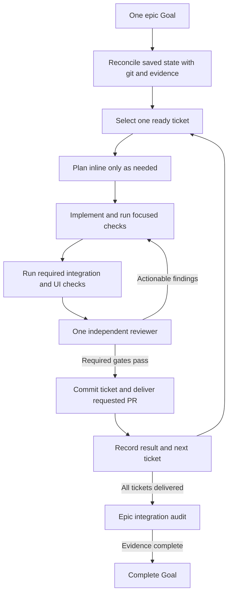

# Codex feature-pipeline run: findings and proposed execution contract

Research date: 2026-09-08. Recommendation: use one epic-level Codex Goal with a flatter, serial ticket runner. Prototype that runner in this marketplace before making a separate Codex plugin. Preserve verification and ticket contracts; change orchestration, delivery boundaries, and state management.

## Evidence and scope

Examined the [shared run](https://chatgpt.com/s/cx_6aa040e188f081918404287d0a19028a), its locally available transcript, the PS-103 ticket tree, the current personal-server change inventory and implementation, and this plugin at `8287aaa`. The installed 3.6.0 plan/build/runtime-codex files match the checkout byte-for-byte. This is not a diagnosis of a stale installation.

The linked implementation audit documents source coverage and limitations. This investigation did not resume implementation, commit personal-server changes, run its expensive suites, change configuration, or deploy anything. Passing-test counts below are historical run evidence, not freshly rerun certification. Runtime limits and failure observations are specific to the examined session; no universal Codex-versus-Claude concurrency number is assumed.

- [Implementation and code audit](/Users/serhiinadtochii/Projects/feature-pipeline/docs/research/2026-09-08-implementation-audit.md)
- [Official Goals and Matt Pocock source comparison](/Users/serhiinadtochii/Projects/feature-pipeline/docs/research/2026-09-08-goals-and-matt-pocock.md)
- [Local run transcript](/Users/serhiinadtochii/.codex/sessions/2026/09/07/rollout-2026-09-07T23-11-24-01a07d7f-3649-71a0-a687-135ceaa8904a.jsonl)
- [Epic progress](/Users/serhiinadtochii/Projects/personal-server/claudedocs/tickets/in-progress/PS-103/progress.md) and [requirement register](/Users/serhiinadtochii/Projects/personal-server/claudedocs/tickets/in-progress/PS-103/requirements-evidence.md)

The run had 13 child tickets, all labeled L. At inspection, PS-104–109 were marked done, PS-110 was in progress, and PS-111–116 were backlog. Git remained at the initial `d19f5e0` commit on `feature/PS-103-personal-assistant-v1`: no epic implementation commits. Inventory: 54 modified tracked files plus 339 untracked files, including 107 files under `output/`; 286 changed/new files outside `output/`. The epic directory contained 91 files, including specs, source snapshots, and evidence. These counts are files, not independent changes or defects.

The local root transcript contains 42 spawn calls, 11 explicit `agent thread limit reached` responses, 45 follow-up calls, and 13 compaction records. A late goal snapshot reports 39,796 seconds and 8,184,711 accounted tokens. Token accounting includes context consumption and is not a measure of generated code, unique reasoning, or monetary cost. These numbers establish substantial orchestration/context activity, not its exact fraction of runtime.

## What happened, and why

| Finding | Evidence and interpretation | Change needed |
|---|---|---|
| Mandatory planning delegation stopped useful work | PS-106 had completed exploration but could not start an analyst. The runtime required a fresh child and forbade inline replacement; plan required a user choice on subagent failure. This converted a scheduling problem into a workflow-approval question. | Let the implementation owner perform planning/analysis inline by default. Delegate only when it adds value. |
| Serial spawning alone did not solve capacity | Fresh review calls failed even after children reported completion. No close/release operation was exposed. Later, after “so spawn them in sequence,” the first fresh serial attempt still failed; progress came through reuse of existing contexts. | Distinguish running capacity from retained/open agent slots. Define reusable reviewer policy and actual release capability at entry. Do not promise that waiting always frees a slot. |
| Goal continuation amplified an unchanged impasse | PS-106 and PS-108 repeatedly restated the same capacity blocker and reached the three-turn blocked threshold. The goal continued faithfully; it could not override a required unavailable operation. | Persist a blocker fingerprint and its recovery action. Retry only after relevant evidence changes; keep host goal lifecycle rules authoritative. |
| No per-ticket delivery boundary | The consuming [AGENTS.md](/Users/serhiinadtochii/Projects/personal-server/AGENTS.md:95) says to use plan/build and commit only when asked. The initial goal did not expressly request commits. The agent chose `--no-commit`, carried it across the epic, and the pipeline legitimately marked tickets done without commits. | Resolve commit/PR authority once before an unattended epic. For commit-based runs, completion must include a ticket commit, not only a summary. Respect the existing rule until authorization changes. |
| The actual run was already flatter than flow/ship | The root directly executed plan/build and spawned leaf roles; its spawn inventory contains explorers, analysts, reviewers, a tester and arbiter, rather than separate plan/build stage workers. | Do not blame this incident on nested flow stages alone. Removing mandatory leaf roles and clarifying fallback remain necessary even with inline stages. |
| Current flow/ship add further agent overhead | Flow requires stage children. Ship adds implementer and independent-review/address hops around flow, while build already has four reviewers. The runtime reserves worker + stage + leaf capacity. | Main agent owns serial ticket execution. One reviewer child at a time; no orchestration child merely to relay instructions. |
| Review diff is incomplete | Build collects `git diff base...HEAD` plus `git diff`. Both omit untracked files; their combination also omits staged-only changes relative to HEAD. A temporary-repository probe reproduced empty review input with real untracked-only and staged-only implementation. | Build review input from a complete snapshot, including staged, unstaged, added, renamed and deleted paths. |
| Review scope grows across the epic | Build compares against the repository base, not the ticket start. Here HEAD was already 18 commits ahead of local `origin/main`, and all new epic work accumulated uncommitted. Later review artifacts explicitly supplemented untracked source, but that was a run-specific workaround. | Record the ticket's base commit and changed-path manifest before implementation. Review its delta and inspect dependencies as context. Do not assert that every actual reviewer missed untracked code. |
| Broad staging would defeat ticket-sized commits | Shared commit mechanics use `git add -A`, excluding bookkeeping and specific session files. Applied late to this dirty epic tree, this would sweep multiple tickets and output files into one commit. It was not executed in the examined run. | Commit only owned ticket changes. Require a clean ticket boundary or an explicit baseline/ownership map. |
| Evidence files drifted | PS-110 progress still described Turn 7, its review artifact retained accepted changes required, while later source fixes and follow-up reports had advanced. PS-109's final pass file also retained earlier pending/browser-in-progress prose. | One current structured state and one reconciled result; chronological logs separate from current truth. |
| Resume can trust stale success | Build exits on a `06-summary.md` pass before verifying source freshness. Other routes use file mtimes. Those do not establish that evidence covers current code, dependencies, config or test environment. | Key evidence to commit/tree fingerprint, spec/plan revision and applicable environment. Invalidate only affected checks. |
| Review occurs before browser-driven code fixes | Build's test checkpoint applies fixes and proceeds to the verdict without an explicit review return edge. This run voluntarily added focused follow-up reviews, but the general contract does not require them. | Any product-code fix invalidates affected review/test evidence; return through the appropriate gates before commit. |
| Browser routing is ambiguous | Build uses substring signals such as `route`, `view`, and `partial`, which can describe backend work. It can pass with an unreachable-app skip. Ship always disables per-ticket UI tests, with an optional end-run pass that does not gate PR outcome. | Explicitly classify ACs and required test surfaces. Backend recurrence needs process/HTTP proof; UI behavior needs browser proof; unavailable required evidence is pending, not pass. |
| One browser interruption was a real approval boundary | PS-104 browser launch stalled, then its escalation was aborted after roughly 15 minutes. The tester could not claim execution. Later an authorized direct browser run completed. | Preflight an isolated browser/test recipe early and preserve process ownership. Do not design a fallback that circumvents aborted approval. |
| Test concurrency caused avoidable failures | The run acknowledged heavy API/web overlap and timeouts, then ran suites serially with four workers. A separate fixture problem hit a different listener until explicit IPv4 loopback binding was verified with 1,000 pairs. | Resource-aware test scheduling, explicit fixture binding and identity, exact process handles, focused checks during edits, final affected/full checks at planned gates. |
| A second loop budget does not bound elapsed effort | Build has a 25-turn counter, a fresh arbiter after four checkpoint turns, and counter reset on resume/compaction. The run used a long-lived goal and multiple compactions. No reliable wall-time guarantee follows from 25 turns. | Let Goal own continuation/lifecycle. Track ticket attempts, failed hypotheses and check cost durably; retain host budget controls without another mandatory arbiter child. |
| These were large engineering units | PS-107 included native protocol adaptation, durable correlation, packaging and runtime isolation; PS-108 included recurrence and organization; PS-110 included notes, links, privacy propagation and UI. Plan explicitly targets 2–4 hours per implementation step. | Size tickets as independently demonstrable vertical outcomes, with internal verified commit checkpoints where necessary. Do not assume a strong model makes every L ticket a short task. |

Pipeline sources for these findings: [Codex runtime](/Users/serhiinadtochii/Projects/feature-pipeline/plugins/feature/skills/flow/references/runtime-codex.md:21), [plan failure policy](/Users/serhiinadtochii/Projects/feature-pipeline/plugins/feature/skills/plan/SKILL.md:273), [build diff and reviewer checkpoint](/Users/serhiinadtochii/Projects/feature-pipeline/plugins/feature/skills/build/SKILL.md:162), [test checkpoint](/Users/serhiinadtochii/Projects/feature-pipeline/plugins/feature/skills/build/SKILL.md:238), [completion/commit routing](/Users/serhiinadtochii/Projects/feature-pipeline/plugins/feature/skills/build/SKILL.md:310), [resumption](/Users/serhiinadtochii/Projects/feature-pipeline/plugins/feature/skills/build/SKILL.md:402), [commit mechanics](/Users/serhiinadtochii/Projects/feature-pipeline/plugins/feature/skills/build/references/commit.md:11), [ship](/Users/serhiinadtochii/Projects/feature-pipeline/plugins/feature/skills/ship/SKILL.md), and [stuck detection](/Users/serhiinadtochii/Projects/feature-pipeline/plugins/feature/skills/build/references/stuck-detection.md).

Additional repository risks, not observed causes in this run: the fs epic walker continues on `in-review` and skips missing child folders, then its completion prose assumes all children are done; dependency guards can still stop a dependent whose predecessor is not done. Build's PR failure degradation can mark a ticket done after only a local commit. These may fit some existing workflows, but an epic Goal requiring all tickets and PR delivery must not reuse those labels as proof of its own completion. See [epic walker](/Users/serhiinadtochii/Projects/feature-pipeline/plugins/feature/skills/flow/references/epic-walk-fs.md) and [build PR completion route](/Users/serhiinadtochii/Projects/feature-pipeline/plugins/feature/skills/build/SKILL.md:369).

## What the implementation review actually contributed

The solution is not to discard review/testing. The run's evidence records useful findings and fixes:

- PS-104: attachment cache policy and smoke-client authentication.
- PS-105: instruction retention after failed Undo/source deletion, and concurrent/replayed execution behavior verified with separate processes.
- PS-106: disclosure/lineage and dependency-boundary fixes; external processing remained disabled without account-control evidence.
- PS-107: pinned native request-shape incompatibilities and runtime/package/isolation checks; fixture/listener faults were distinguished from product faults.
- PS-108: repeated lineage/Project reads; recorded medians improved from 142 to 27 ms and 171 to 11 ms in the same synthetic probes.
- PS-109: stale revision adoption overwriting untouched fields, dirty-draft Undo, receipt links, uncertain-execution recovery, real-router query aliases and focus return.
- PS-110: descendant-limit failures on privacy tightening/deletion, stale source adoption in the integrated note/task form, and expensive backlink projections. The first propagation repair used a SQLite iterator that prevented writes; the subsequent temporary-table/batch implementation corrected that approach. The recorded 1,000-link stress case improved from about 5.1 seconds to about 1.3 seconds, but remains a synchronous performance limitation.

The code audit distinguishes these repaired defects from remaining closure gaps. PS-110 has not completed browser verification and final evidence reconciliation; PS-111–116 are not implemented. Historical green suite counts cannot certify a whole epic whose later tickets are absent. Conversely, unfinished backup/chat/importer features should not be reported as regressions in completed access or task-foundation tickets.

## Goal should own continuation; the runner should own execution

[Official Goals guidance](https://developers.openai.com/cookbook/examples/codex/using_goals_in_codex) describes persistent task objectives, continuation at idle boundaries and evidence-based completion. It asks for auditable outcomes rather than vague breadth. Goals do not themselves select tickets, isolate checkouts, commit work, refresh reviewer contexts or choose verification commands. The current session's goal tool contract permits one unfinished goal per task; it does not support replacing that objective with a new ticket goal on every iteration.

For this use case, prefer one epic Goal and ticket completion predicates underneath it. Separate per-ticket Goals are reasonable for manual dispatch or intentionally separate tasks, but require explicit coordination to deliver the entire epic. They are not necessary for a serial loop, and a goal continuation does not guarantee a fresh context.

The main agent owns implementation, scheduling, git and result state. One child reviews; it must not implement the code it reviews. A single reviewer can cover correctness, spec, security, performance and architecture as lenses. It is one independent review, not four independent reviews. Add specialists only for a named risk or unresolved finding. Reuse of a read-only reviewer across tickets can be an explicit policy, with context contamination disclosed; it is not equivalent to a fresh review. Never silently reclassify an author/explorer as independent of changes it helped design.

If no suitable reviewer can run, proceed with independent implementation/test work where safe, preserve `review_required`, and stop delivery when independent review is mandatory. A previously authorized assisted mode may allow a recorded self-review with a human review gate. Fewer agents reduces capacity demand; it cannot guarantee fresh independent review on a surface unable to supply any new context.

## Proposed ticket contract

This is a design proposal, not an available command or implemented schema.

| Stage | Mandatory result | Skip/continue rule |
|---|---|---|
| Entry | Roster, dependencies, exact starting ref, owned paths, policy and required evidence resolved | Reconcile existing state; do not repeat discovery on refined tickets. |
| Plan | Enough implementation detail to avoid an unresolved design decision | Reuse a current plan; inline planning when a separate artifact adds no value. Routine choices use authorized defaults. |
| Implement | AC-aligned code and focused behavioral checks | Continue through fixable errors; no unconditional full-suite run after each edit. |
| Verify | Required tests passing against the current snapshot | Tests come from repository rules and ticket risks. Browser work is conditional on actual UI ACs, not optional when those ACs require it. |
| Review | Required independent review against the complete ticket delta | One reviewer by default; additional perspectives only when justified. Missing required review remains pending. |
| Fix | Accepted findings corrected, relevant checks and review refreshed | No repeated unchanged review or full verification unless changed code/evidence warrants it. |
| Commit | Ticket commit SHA and owned changes recorded | Mandatory in an authorized commit run. Explicit no-commit mode reports local implementation status separately. |
| PR | Requested PR exists against the declared base | Omit only when the selected delivery mode does not request a PR. PR failure means delivery pending. |
| Advance | Ticket's execution predicate is true and dependent code is available | Never equate skipped, cancelled, partially accepted or merely open-PR tickets with fully satisfied ACs. |

Resolve policy once: commit per ticket or explicit no-commit; one epic PR versus stacked/per-ticket PRs; merge authority; required browser surfaces; reviewer reuse; existing base/branch; permitted fixture/data boundaries. A conflict such as “commit only when asked” and an expected commit-based delivery needs one explicit decision, not an implicit override and not repeated per-ticket prompts.

For the requested default, use a dedicated epic branch with verified commits per ticket and one final epic PR. Every next ticket starts from the preceding verified in-run commit. This avoids waiting for main merges or building dependents from a base missing their prerequisites. If ticket PRs are desired, select stacking or an integration-branch strategy explicitly. Merging intermediate PRs must be authorized separately from leaving the final PR open. Existing `ship` already provides an integration-branch strategy, but brings its nested review and verification policies with it.

Keep a compact machine-readable run state: schema version, epic/roster/spec fingerprints, current ticket/phase, starting ref, current tree fingerprint, review/test evidence references, commit SHA, PR/base, owned processes and exact next action. Before commit use a tree fingerprint that includes untracked implementation; afterward use the commit plus dirty-state checks. Writes should be atomic, and resume should reconcile state with git/PR reality so a crash after commit does not duplicate a commit or PR.

Use one result document per ticket with current AC-to-evidence mapping and findings disposition. Keep verbose logs, raw role reports, screenshots and temporary diagnostics beneath a bounded run-evidence directory. Existing `01`–`06` artifacts can remain as compatibility views initially; do not add another competing source of truth or change server-native artifact names without a schema migration.

## Packaging and adoption

Do not fork the entire feature plugin first. The failures arise from policy and execution contracts, not manifest format. A separate plugin retaining fresh explorer + analyst + four reviewers + tester + arbiter + nested ship would reproduce them.

Prototype a Codex-specific runner within this repository, behind a distinct skill entry point. Reuse ticket specs, dependency semantics, storage adapters, good review rubrics and safe PR primitives after correcting their contracts. Avoid making the new runner a wrapper that merely calls unchanged `flow`/`build`: that imports the same mandatory spawns and gates. Keep runtime identity separate from storage mode.

After proving the runner, a sibling Codex-only plugin in this existing multi-plugin marketplace is a sensible packaging choice if it materially simplifies installation and instructions. Share or generate common contracts rather than maintaining divergent copies. Separate repositories are unnecessary at this stage. Claude's workflow can remain supported independently.

Matt Pocock's skills provide a useful direction: smaller composable instructions, verifiable vertical slices, behavioral tests, and an explicit implementation/review/commit sequence. They are not a turnkey Goal runner. His current `code-review` still requires two parallel reviewers; `tdd` and `to-tickets` retain clarification/approval points; `implement` supplies no epic resumption protocol. The source comparison also identifies a review-before-commit diff gap. Adopt the discipline and adapt composition; replacing plugin names alone does not solve this run's problems.

## Smallest useful validation experiment

Build a prototype and test it on a separate consuming fixture with three dependent tickets. Require meaningful API behavior, a browser-visible change and one integration edge. Measure ticket completion, commits, repeated checks, stalls and context/spawn activity rather than raw artifact count alone.

Acceptance cases:

1. One reviewer slot, no nested spawning: all three tickets produce verified commits and the requested final PR.
2. Fresh agent creation rejected after one child: reuse policy is applied honestly or required review becomes a precise pending gate; no repeated identical permission question.
3. Untracked-only, staged-only, renamed/deleted and unrelated dirty changes: review and staging include exactly the intended ticket delta.
4. Interrupt after implementation, review fix, commit and PR creation: resume the first incomplete gate without duplicate work or publication.
5. Browser fix changes product code: affected tests and review rerun before commit.
6. Required browser unavailable, PR creation failure or unmet dependency: no false completion and no lost implementation evidence.
7. Completed summary with changed code/spec: stale evidence is invalidated; restored artifacts alone do not prove success.
8. Heavy suites plus fixtures: bounded concurrency, correct server identity and cleanup; no weakened assertions to make failures disappear.
9. At least several ticket boundaries and a compaction: state remains coherent; previous-ticket changes do not inflate the next review.

The existing runtime-contract, tool-parity and mode-split checks all pass in this checkout. The isolated Git probe demonstrates their coverage gap: structural validity does not prove correct review input. The repository's [FP-82 smoke evidence](/Users/serhiinadtochii/Projects/feature-pipeline/docs/plans/FP-82-runtime-verification.md) also correctly distinguishes a successful desktop fixture from a CLI configuration lacking nested spawn tools; it does not establish long-epic reliability.

For the paused personal-server work, preserve the current tree first. A later authorized recovery should reconcile PS-110, establish commit ownership across the accumulated changes, verify any reconstructed intermediate snapshots, and create reviewable commits before advancing PS-111. Blindly applying the current `git add -A` path would not recover ticket boundaries. This analysis does not authorize or perform that recovery.
